<div align="center">
  <h1>🏥 VaidyaMitra</h1>
  <p><b>Privacy-First Clinical Intelligence Platform</b></p>
  <p><i>AI-powered healthcare decision-support for Bharat 🇮🇳 — Making quality clinical intelligence accessible, affordable, and privacy-compliant.</i></p>

  <br />
  <a href="https://vaidyamitra.duckdns.org/">
    
  </a>
  <p><b>🚀 Deployed at:</b> <a href="https://vaidyamitra.duckdns.org/">vaidyamitra.duckdns.org</a></p>
  <br />

  [](#)
  [](#)
  [](#)
  [](https://nextjs.org/)
  [](https://fastapi.tiangolo.com/)
</div>

---

<br />

> 📸 **Platform Overview:** Role-Based Access and Welcome Portal.
> 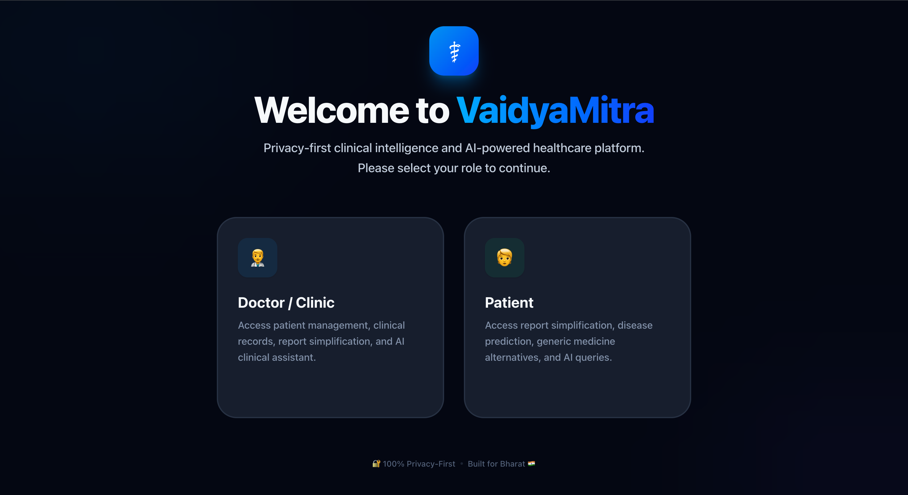
>
> 📸 **Dashboard Analytics:** Executive Clinical Summary with live patient insights.
> 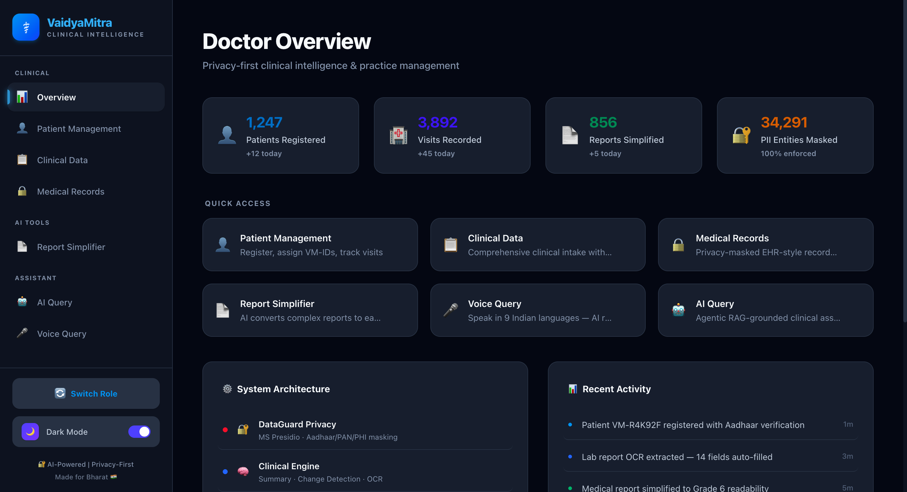

## Table of Contents

- [The Problem — Why This Exists](#the-problem--why-this-exists)
- [What VaidyaMitra Does — Solution Overview](#what-vaidyamitra-does--solution-overview)
- [Key Features — Full Feature List](#key-features--full-feature-list)
- [Architecture — Full System Architecture](#architecture--full-system-architecture)
- [DataGuard Privacy Pipeline — Deep Dive](#dataguard-privacy-pipeline--deep-dive)
- [Agentic AI Orchestration Flow](#agentic-ai-orchestration-flow)
- [Tech Stack — Full Table](#tech-stack--full-table)
- [Screenshots Showcase](#screenshots-showcase)
- [Project File Structure](#project-file-structure)
- [API Reference](#api-reference)
- [Setup & Installation](#setup--installation)
- [Environment Variables Reference](#environment-variables-reference)

---

## The Problem — Why This Exists

Healthcare in India (Bharat) faces immense scale challenges. During extremely short consultation times, a doctor must parse through unorganized historical records, varying lab reports, complex symptoms, and previous prescriptions. Consequently, key clinical context is often missed.

Simultaneously, patient privacy is continuously compromised. When raw medical data containing *Personally Identifiable Information (PII)* or *Protected Health Information (PHI)* is sent to third-party cloud AI models for analysis, strict domestic and international healthcare guidelines are typically bypassed. 

Additionally, patients struggle with unaffordable branded medicines and complex medical jargon that deters proper care adherence. 

> **The Critical Gap:** No existing tool seamlessly combines **Privacy-by-Design** (mandatory PII/PHI masking) with **Agentic Clinical Intelligence** and **Affordable Alternatives** (Jan Aushadhi integration) in a single multilingual platform. VaidyaMitra bridges this gap, empowering Indian doctors to make faster, safer, and more informed decisions without risking patient data.

---

## What VaidyaMitra Does — Solution Overview

VaidyaMitra is an autonomous AI clinical assistant. It is not rule-based; it utilizes an intent-aware agentic pipeline that processes clinical information, maintaining strict privacy standards at every stage.

1. **🔒 Anonymizes Data Instantly:** Scans and scrubs all text, PDFs, images, and JSONs for Aadhaar, PAN, phone numbers, and names using Microsoft Presidio and robust heuristics *before* any AI processing takes place.
2. **🧠 Reasons & Synthesizes:** Utilizes AWS Bedrock's Meta Llama 3 8B Instruct model to generate structured clinical summaries, detect historical changes, and predict differential diseases.
3. **💊 Recommends Jan Aushadhi:** Cross-references branded medicines with the PMBJP catalog to suggest affordable generic alternatives, calculating exact patient savings.
4. **📄 Simplifies Reports:** Translates complex medical jargon into Grade 6 readability for higher patient understanding.
5. **🎤 Listens & Speaks:** Processes multilingual voice queries in 9 Indian languages plus English, translating them into internal AI intent routes.
6. **🌐 Routes Autonomously:** An Agentic Orchestrator dynamically categorizes user intents and delegates them to specialized AI sub-agents.

> ⚠️ **Disclaimer:** VaidyaMitra is strictly a decision-support tool. It does NOT provide diagnosis or treatment recommendations without professional human validation.

---

## Key Features — Full Feature List

### 1. DataGuard Privacy System
The core checkpoint of VaidyaMitra. It executes mandatory PII/PHI masking using NLP-based Microsoft Presidio combined with custom Regex patterns (Aadhaar, PAN). It handles text, PDFs, images (via OCR), and JSON scrubbing. Everything is logged in an immutable audit trail, ensuring consistent tokenization within a unified session.

### 2. Clinical Data & Patient Lifecycle Management
End-to-end VM-ID generation, Aadhaar verification, visit tracking, and profile management. It consumes complex clinical intakes (vitals, complaints, assessments) and generates deep AI-powered clinical summaries highlighting progressive changes.

### 3. Report Simplifier & OCR Pipeline
AI medical report translation that converts complex jargon to Grade 6 readability. Supports versatile PDF/image OCR ingestion utilizing PyMuPDF alongside Pytesseract machine vision mapping.

### 4. Disease Predictor (Medicure ML)
Provides proactive, symptom-based risk assessment spanning over 60 conditions by fusing algorithmic Medicure ML patterns with real-time Meta Llama 3 contextual AI reasoning. Suggests necessary diagnostic tests to the physician.

### 5. Jan Aushadhi Engine
Actively finds affordable generic alternatives utilizing the official PMBJP catalog offline or via AI equivalents. Features price comparisons and savings calculations directly allowing doctors to provide socio-economically viable prescriptions.

### 6. Medicine Identifier
Offers comprehensive branded vs. generic lookups, AI-powered image identification (pill & packaging scanning), and robust drug safety, composition, and side-effect comparison logic.

### 7. Agentic AI Query (RAG)
Features an intent-aware semantic orchestrator that dynamically routes queries to specialized sub-agents based on context constraint parameters, grounded by Amazon Titan Text Embeddings (Retrieval Augmented Generation).

### 8. Voice & Multilingual Interface
Delivers seamless native support for 9 Indian languages via AI-powered Bedrock localized translation arrays + medical phrase fallback mechanisms. Allows voice transcription processing in regional dialects.

---

## 🏛️ Architecture — Full System Architecture

VaidyaMitra is designed as a cohesive hybrid application where privacy is physically decoupled as a mandatory middleware layer before reaching any intelligence clusters.

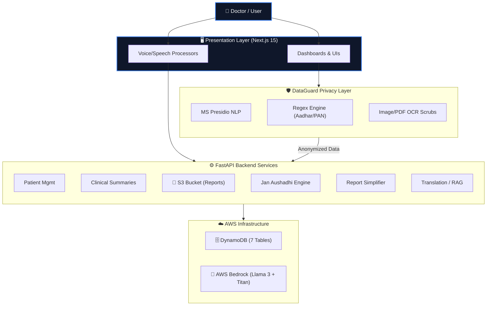

---

## DataGuard Privacy Pipeline — Deep Dive

This ensures **consistent tokenization** within a session. For instance, if an Aadhaar number is substituted with `<AADHAAR_1>`, it remains `<AADHAAR_1>` across the entire interaction sequence to maintain contextual integrity for the downstream LLM processing chains.

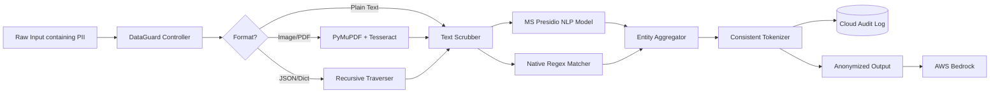

---

## Agentic AI Orchestration Flow

Instead of requiring the doctor to select a specific AI tool module manually, the Orchestrator classifies latent linguistic intent and cleanly marshals data context payloads to specialized "Sub-Agents."

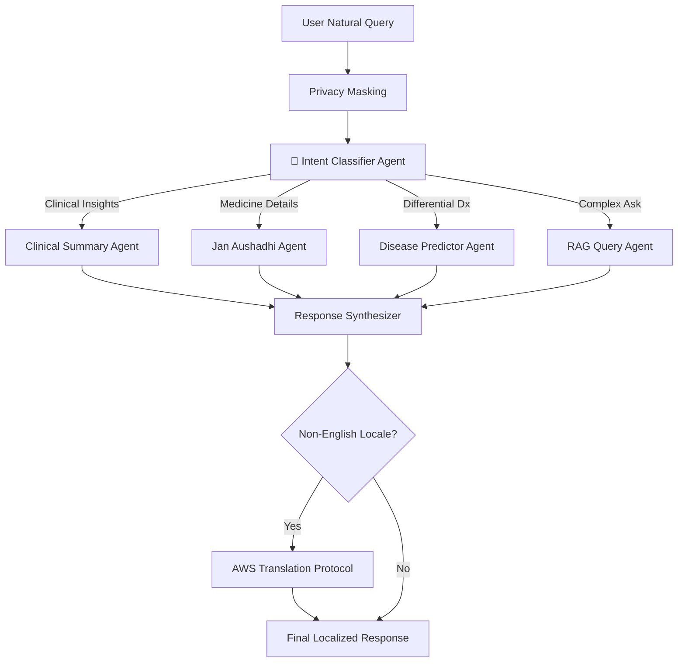

---

## Tech Stack — Full Table

| Layer | Technology | Version | Why This Choice |
|---|---|---|---|
| Frontend Framework | Next.js | 15.0 | App Router, Server Components, lightning-fast transitions |
| UI Styling | Tailwind CSS | 4.0 | Utility-first, enterprise medical dark/light themes |
| Backend Runtime | FastAPI | Python 3.11 | Complete asynchronous REST processing handling AI bounds |
| Primary Intelligence | AWS Bedrock Llama 3 | 8B Instruct | Maximum contextual medical reasoning with cost sustainability |
| Embeddings Generator | Amazon Titan | Text v2 | Native robust RAG vectorization mappings |
| Privacy Detection | Microsoft Presidio | PII Engine | Multi-Entity native NLP detection preventing regex gaps |
| Persistence Database | AWS DynamoDB | Serverless | Massively scalable sub-ms clinical context schemas |
| Media Storage Vault | Amazon S3 | Blob | Immutable storage layer for unorganized legacy clinical records |
| Optical Machine Vision | PyMuPDF + OpenCV | Stack | Multi-layer hybrid extraction for scanned non-search PDFs |
| CI/CD Pipeline | Docker + Nginx | Native | Cloud agnostic deployments enabling easy hybrid transitions |

---

## Screenshots Showcase

Below is a detailed look at the 10 distinct modules of the VaidyaMitra platform acting together seamlessly.

| Module Area | Screenshot Demonstration |
|-------------|----------------------------|
| **Patient Management**<br/>Complete tracking of the patient lifecycle | 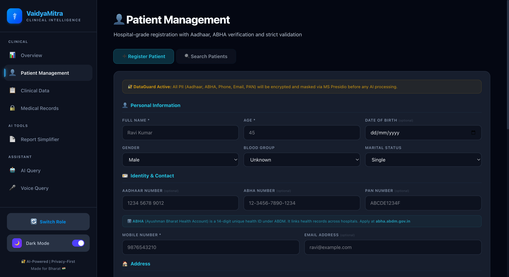 |
| **Clinical Data**<br/>Streamlined patient symptom & vitals intake | 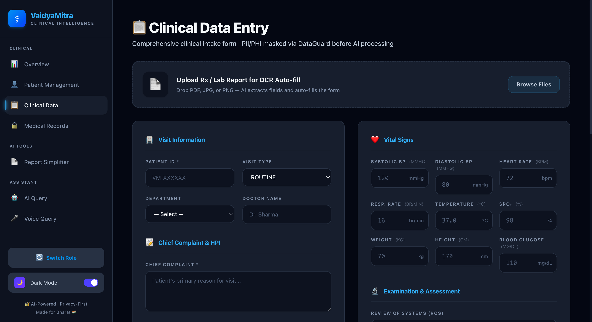 |
| **Medical Records**<br/>EHR-style holistic timeline organization | 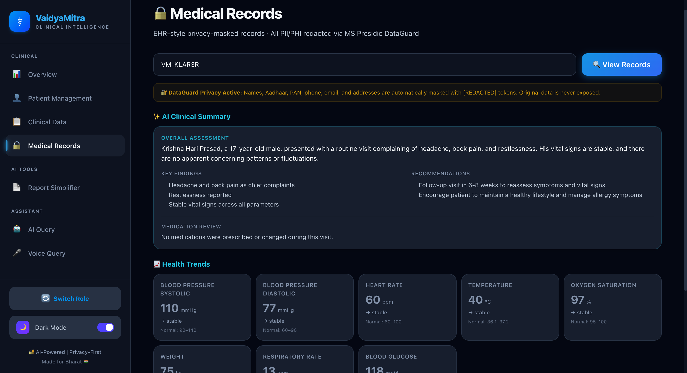 |
| **Report Simplifier**<br/>AI-driven jargon translation (Grade 6 target level) | 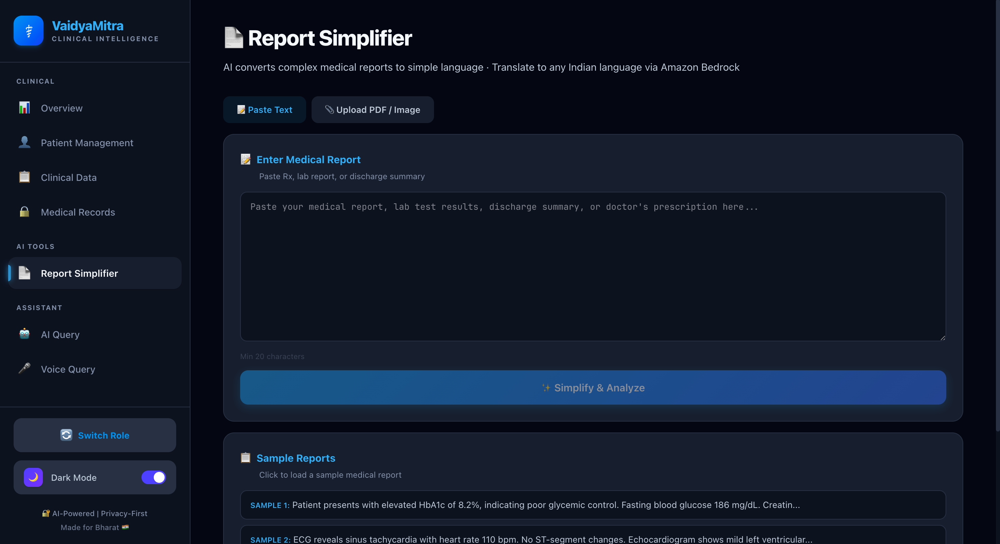 |
| **Disease Prediction**<br/>Symptom-based analytical pattern modeling | 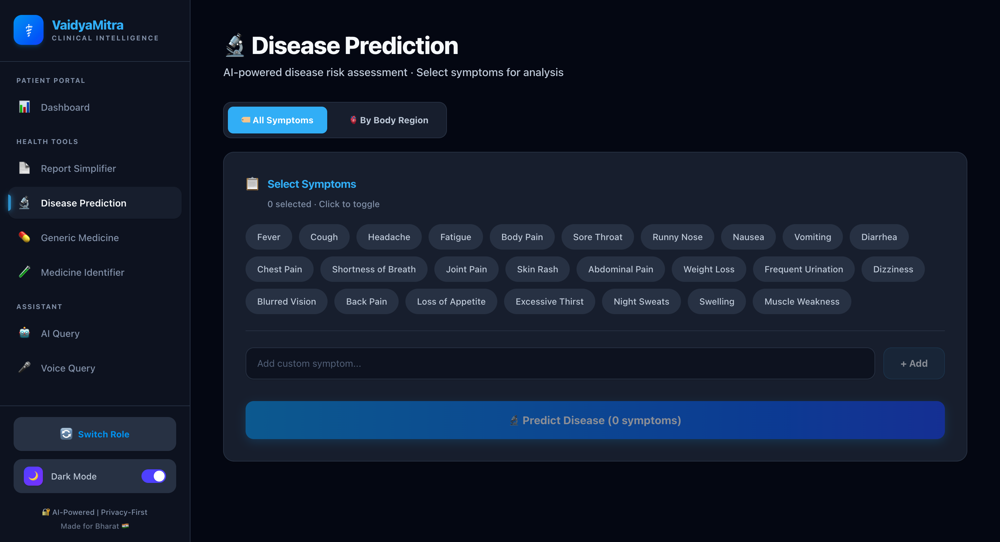 |
| **Generic Medicine**<br/>Jan Aushadhi (PMBJP) savings engine calculation | 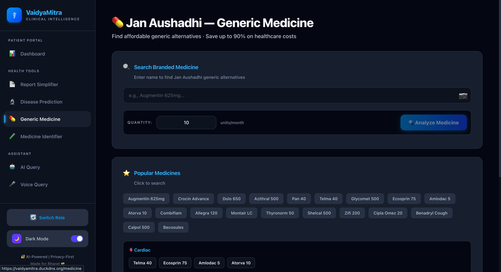 |
| **Medicine Identifier**<br/>Deep Branded vs Generic clinical composition reviews | 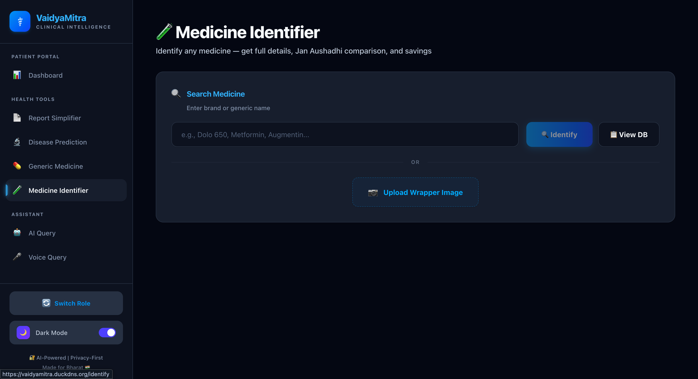 |
| **Voice Query**<br/>9 Locale Multilingual Speech-to-Text inference | 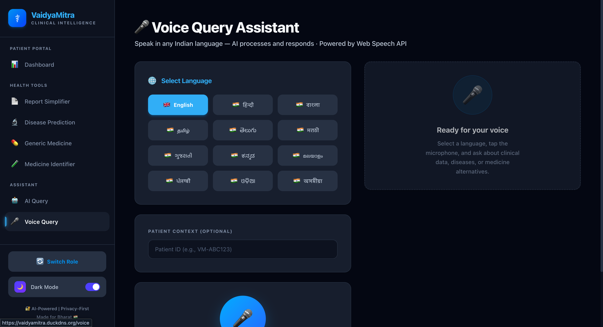 |
| **AI Query**<br/>RAG-equipped Agentic UI built directly on Bedrock | 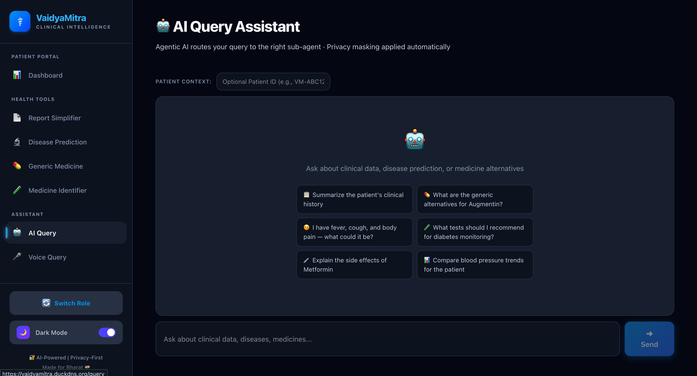 |

---

## Project File Structure

```text
VAIDYAMITRA/
├── backend/
│   ├── app/
│   │   ├── agents/          # Intent-aware orchestration modules
│   │   ├── api/             # 35+ Protected REST FastAPI Endpoints
│   │   ├── core/            # DynamoDB, S3, LRU Caching Interfaces
│   │   ├── lambdas/         # Serverless functions & Native OCR scripts
│   │   ├── middleware/      # Strict SLA rate limiters & Privacy logs
│   │   ├── models/          # Explicit Pydantic typings schemas for IO
│   │   └── services/        # Intermediary layers: Bedrock, Translators
│   ├── lambda_handler.py    # AWS API Gateway Serverless execution adapter
│   ├── requirements.txt     # Locked Python compilation bounds
│   └── main.py              # Root Application ASGI Server Init
├── frontend/
│   ├── src/
│   │   ├── app/             # Application DOM Router Paths (Next.js 15)
│   │   ├── components/      # Dynamic React Server & Hydration Components
│   │   └── lib/             # Remote API fetch hooks and interface classes
│   ├── tailwind.config.ts   # Design language variables formulation
│   └── next.config.ts       # Webpack routing logic constraints
├── aws/                     # Standardized AWS SAM Infrastructure Templates
├── nginx/                   # Proxy routing payload descriptors
├── docker-compose.yml       # Monolith local evaluation structure
└── deploy.sh                # Continuous integration EC2 pipeline triggers
```

---

## API Reference

All endpoints natively secure under the primary overarching route `/api/v1/`. Below is an abstract of the core systems:

| Route Group | Primary Endpoints | Purpose Description |
|---|---|---|
| **Privacy Layer** | `POST /scrub/text`, `/scrub/image` | Executes deep MS Presidio + RegEx PII payload redactions. |
| **Patient Mgmt** | `POST /patients/register`, `GET /patients/{id}` | Standard structured CRUD mapped explicitly via VM-IDs securely. |
| **Clinical Insights** | `GET /patients/{id}/ai-summary` | Autonomously triggers Bedrock rendering historical differentials. |
| **Generic Systems** | `POST /generic-medicine/image` | Executes Computer Vision matrix referencing the offline PMBJP CSV arrays. |
| **Orchestrators** | `POST /query` | Handles all abstract text querying bound strictly against the NLP router maps. |
| **Translative Subsystems** | `POST /simplify-report`, `/translate` | Triggers parallel regional AWS text transformations maintaining native dialects. |

---

## Setup & Installation

Before initializing, ensure absolute access to Python 3.11+, Node.js 18+, alongside configured AWS IAM Account credentials mapping to Bedrock capabilities.

```bash
# 1. Clone the repository directly
git clone https://github.com/VaidyaMitra/VaidyaMitra.git
cd VaidyaMitra

# 2. Compile Backend Servers
cd backend
python -m venv venv
source venv/bin/activate
pip install -r requirements.txt
cp .env.example .env # Vital step: Edit .env & inject AWS Identifiers.

# Start asynchronous backend API server
python -m uvicorn app.main:app --reload --host 0.0.0.0 --port 8000

# 3. Compile Frontend Routers
cd ../frontend
npm install

# Start Next.js hot-reloaded development engine
npm run dev
```

*Frontend instances will mount standard to `http://localhost:3000` — Backend API testing docs mount standard to `http://localhost:8000/api/docs`.*

---

## Environment Variables Reference

Configuring the `.env` internally inside `/backend/` safely operates the core VaidyaMitra connections structure.

| Key | Core Requirement | Intended Usage Path |
|----------|-------------|---------|
| `AWS_ACCESS_KEY_ID` | **Required** | Secure AWS authentication signature entry. |
| `AWS_SECRET_ACCESS_KEY` | **Required** | Secure AWS secret signature mapped entry. |
| `BEDROCK_MODEL_ID` | Internal Override | Targets model context defaults (`meta.llama3-8b-instruct-v1:0`). |
| `BEDROCK_EMBEDDING_MODEL_ID` | Internal Override | Targets Bedrock array maps (`amazon.titan-embed-text-v2:0`). |
| `AWS_REGION` | Structural Constraint | Locational bounding instance (`ap-south-1`). |
| `PRESIDIO_CONFIDENCE_THRESHOLD` | Sensitivity Threshold | Defaults mapped safely standardizing to `0.5`. |
| `DYNAMODB_TABLE_PREFIX` | Environment Constraint | Ensures parallel DB tables (`vaidyamitra_`). |
| `AI_MODE` | Evaluation Handle | Overrides structural costs for pure software execution checking (`auto`/`bedrock`/`mock`). |

---

<div align="center">
  <b>Architected by Adarsh Dwivedi — VaidyaMitra Enterprise Architecture</b>
</div>
