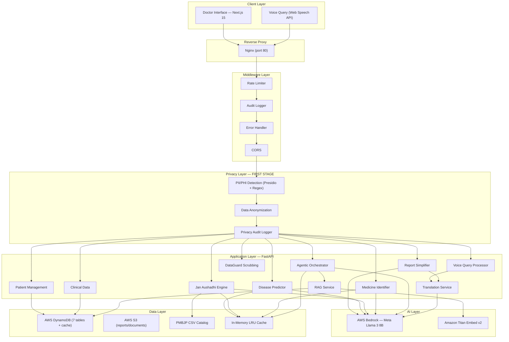
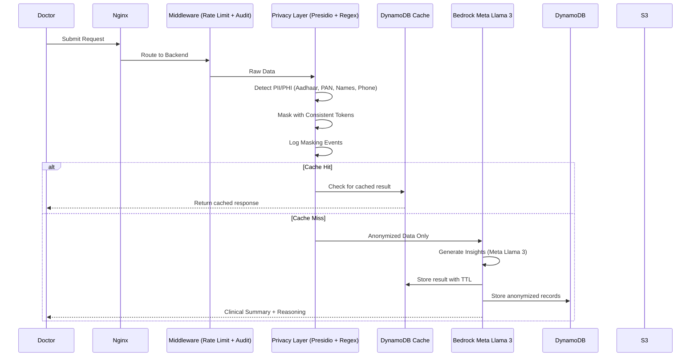
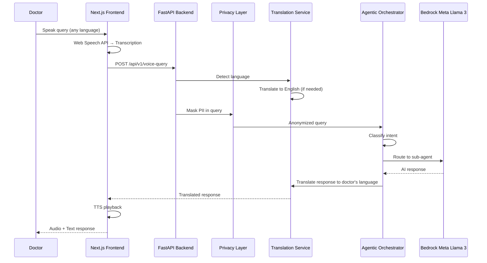

# Design Document: VAIDYAMITRA

## Overview

VAIDYAMITRA is a privacy-preserving clinical intelligence system that enhances doctor efficiency through AI-powered analysis of patient data. The system employs a multi-layered architecture with privacy protection as the foundational layer, ensuring all sensitive information is anonymized before any AI processing occurs.

The system integrates multiple AI and data services — AWS Bedrock (Meta Llama 3) for clinical reasoning, Amazon Titan for embeddings, Microsoft Presidio for PII detection, and a custom regex engine for Indian-specific identifiers (Aadhaar, PAN) — to provide semantic clinical summarization, temporal change detection, disease prediction, generic medicine search, report simplification, and multilingual natural language query capabilities.

**Key Design Principles:**
- Privacy-first architecture with mandatory PII/PHI masking
- Real AI reasoning via AWS Bedrock Meta Llama 3 (not rule-based)
- Decision-support only (no diagnosis or treatment)
- Agentic orchestration with intent-aware routing
- DynamoDB-backed caching for AI result reuse
- Human-in-the-loop approach
- Scalable cloud-native design (EC2/Docker + Lambda/SAM)

## Architecture

### High-Level Architecture



### Privacy-First Data Flow



### Voice Query Flow



## Components and Interfaces

### 1. Privacy Layer (`app/services/privacy_layer.py`)

**Purpose:** Detect and mask all PII/PHI before any AI processing occurs.

**Components:**
- **Presidio Detector**: Microsoft Presidio NLP-based PII detection (when available)
- **Regex Detector**: Custom regex patterns for Indian-specific PII (Aadhaar, PAN) — always available as fallback
- **Consistent Tokenizer**: Same PII maps to same token within a session
- **Privacy Audit Logger**: Records all detection and masking operations

**Detected Entity Types:**
- `PERSON` — Names (Dr./Mr./Mrs. patterns, Indian name patterns)
- `PHONE_NUMBER` — Indian phone formats (+91, 10-digit)
- `AADHAAR_NUMBER` — 12-digit Indian national ID (XXXX-XXXX-XXXX)
- `PAN_NUMBER` — Indian tax ID (ABCDE1234F format)
- `EMAIL_ADDRESS` — Email addresses
- `MEDICAL_RECORD_NUMBER` — MRN/hospital ID patterns
- `ADDRESS` — Physical addresses

**Key Interface:**

```python
class PrivacyLayer:
    def __init__(self, confidence_threshold: float = 0.5)
    def detect_pii_phi(self, text: str, language: str = "en", entities: Optional[List[str]] = None) -> List[DetectedEntity]
    def mask_entities(self, text: str, detected_entities: List[DetectedEntity]) -> AnonymizedData
    def detect_and_mask(self, raw_data: str, language: str = "en") -> AnonymizedData  # Primary method
    def create_privacy_event(self, event_type: str, anonymized_data: AnonymizedData, ...) -> PrivacyEvent
    def reset_session(self)
    def health_check(self) -> Dict[str, Any]
```

---

### 2. Bedrock AI Client (`app/services/bedrock_client.py`)

**Purpose:** Provide AI reasoning via AWS Bedrock or mock mode for local development.

**Modes:**
- `bedrock` — Real AI inference via AWS Bedrock Meta Llama 3 8B Instruct
- `mock` — Structured JSON mock responses for development without AWS

**Key Interface:**

```python
class BedrockClient:
    def __init__(self, model_id: Optional[str] = None, temperature: float = 0.3, max_tokens: int = 4096, timeout: int = 30)
    def invoke(self, prompt: str, system_prompt: Optional[str] = None, image_bytes: Optional[bytes] = None, ...) -> str
    def invoke_json(self, prompt: str, system_prompt: Optional[str] = None, ...) -> Dict
    def invoke_with_template(self, template: str, variables: Dict[str, Any], ...) -> str
    def health_check(self) -> Dict[str, Any]
```

**AI Configuration:**
- Model: `meta.llama3-8b-instruct-v1:0`
- Temperature: 0.3 (balanced creativity and consistency)
- Max Tokens: 4096
- Timeout: 30 seconds
- Supports both text and multimodal (image) input

---

### 3. Agentic Orchestrator (`app/agents/orchestrator.py`)

**Purpose:** Intent-aware routing layer that classifies queries and delegates to specialized sub-agents.

**Intent Types:**
- `clinical_summary` — Generate patient clinical summary
- `change_detection` — Detect changes between visits
- `disease_prediction` — Predict diseases from symptoms
- `generic_medicine` — Find generic alternatives
- `clinical_query` — General clinical question (RAG-grounded)
- `risk_monitoring` — Risk assessment
- `unknown` — Unclassified query

**Processing Pipeline:**
1. Apply privacy masking to query
2. Check DynamoDB cache for identical masked query
3. Classify intent using keyword matching
4. Route to appropriate sub-agent
5. Cache result with service-specific TTL
6. Return structured response

**Key Interface:**

```python
class OrchestratorAgent:
    def classify_intent(self, query: str) -> str
    def process_request(self, query: str, patient_id: Optional[str] = None,
                       clinical_visit: Optional[ClinicalVisit] = None,
                       previous_visit: Optional[ClinicalVisit] = None,
                       context: Optional[Dict[str, Any]] = None) -> Dict[str, Any]
```

---

### 4. Patient Service (`app/services/patient_service.py`)

**Purpose:** Full patient lifecycle management with DynamoDB persistence.

**Capabilities:**
- Patient registration with VM-ID generation
- Aadhaar-style verification
- Visit recording with vitals, diagnoses, assessments
- EHR-style records retrieval
- Health trend analysis across visits
- AI-powered comprehensive patient summaries

---

### 5. Disease Predictor (`app/services/disease_predictor.py`)

**Purpose:** Symptom-based disease prediction combining rule-based mapping with AI reasoning.

**Approach:**
1. Rule-based: 60+ symptom-disease mappings from Medicure ML patterns
2. AI-enhanced: Bedrock generates risk percentages and clinical reasoning
3. Recommended tests: Mapped per disease (CBC, culture tests, imaging, etc.)
4. Cached: DynamoDB cache with sorted symptom keys for order-independence

---

### 6. Jan Aushadhi Engine (`app/services/generic_medicine_engine.py`)

**Purpose:** Find affordable generic alternatives from the PMBJP government catalog.

**Data Source:** Local CSV catalog (`app/data/pmbjp_list.csv`) with 50+ medicines
**Features:** Fuzzy name matching, price comparison, savings calculation, AI-enhanced search, image-based identification

---

### 7. Report Simplifier (`app/services/report_simplifier.py`)

**Purpose:** Convert complex medical reports to patient-friendly language.

**Modes:**
- AI mode: Bedrock Meta Llama 3 generates Grade 6 readability text
- Fallback: Jargon replacement map (40+ medical terms)

**Output Structure:** Overview, key findings, health concerns, action items, medications, severity assessment

---

### 8. Translation Service (`app/services/translation_service.py`)

**Purpose:** Multilingual support for 10 languages.

**Supported Languages:** English, Hindi, Bengali, Tamil, Telugu, Marathi, Gujarati, Kannada, Malayalam, Punjabi

**Features:**
- Unicode script-based language detection
- AI-powered translation via Bedrock
- Medical phrase-swap fallback for Hindi
- Pre-translated UI strings for all languages

---

### 9. RAG Service (`app/services/rag_service.py`)

**Purpose:** Retrieval-Augmented Generation for context-grounded AI responses.

**Approach:**
- Amazon Titan Embed v2 for text embeddings
- DynamoDB storage for embeddings
- Cosine similarity retrieval
- Context injection into Bedrock prompts
- 30-day cache TTL for embeddings

---

### 10. DataGuard Service (`app/services/dataguard_service.py`)

**Purpose:** Multi-format privacy scrubbing service.

**Supported Formats:**
- Text: Direct PII/PHI detection and masking
- Images: OCR extraction → PII detection → masked output
- PDFs: Page extraction → OCR → PII detection → masked text
- JSON/Dict: Recursive key-value PII scanning

---

### 11. Cache Client (`app/core/cache_client.py`)

**Purpose:** Two-tier caching for AI result reuse.

**Tiers:**
- In-memory LRU cache (500 items, instant access)
- DynamoDB persistent cache (configurable TTLs per service)

**TTL Configuration:**
| Service | TTL | Rationale |
|---------|-----|-----------|
| Medicine ID | 7 days | Drug info rarely changes |
| Jan Aushadhi | 7 days | Catalog updates weekly |
| Disease Prediction | 1 day | Symptoms may evolve |
| Report Simplification | 3 days | Reports are static |
| AI Queries | 12 hours | Context may change |
| RAG Embeddings | 30 days | Content is stable |

---

## Data Models

### Core Pydantic Models

```python
# Patient Models (app/models/patient_models.py)
class PatientRecord(BaseModel):
    patient_id: str          # VM-ID (e.g., VM-R4K92F)
    name: str
    age: int
    gender: str
    blood_group: str
    phone: Optional[str]
    email: Optional[str]
    address: Optional[str]
    allergies: List[str]
    chronic_conditions: List[str]
    current_medications: List[str]
    emergency_contact: Optional[str]
    language_preference: str
    registered_at: str
    last_visit: Optional[str]

# Clinical Models (app/models/clinical.py)
class ClinicalVisit(BaseModel):
    visit_id: str
    patient_id: str
    visit_date: str
    visit_type: str         # ROUTINE, FOLLOW_UP, EMERGENCY
    chief_complaint: str
    vitals: Dict[str, float]
    assessment: str
    plan: str
    diagnosis: List[str]
    notes: str

# Privacy Models (app/models/privacy.py)
class DetectedEntity(BaseModel):
    entity_type: str
    start: int
    end: int
    score: float
    original_text: str

class AnonymizedData(BaseModel):
    masked_text: str
    entity_map: Dict[str, str]
    entities_found: int
    entity_types: List[str]

class PrivacyEvent(BaseModel):
    event_id: str
    event_type: str
    timestamp: str
    entities_detected: List[str]
    action_taken: str

# AI Models (app/models/ai_models.py)
class ClinicalSummary(BaseModel):
    summary_text: str
    key_findings: List[Dict]
    reasoning: List[str]
    confidence: float
    generated_at: str

class DiseaseOutput(BaseModel):
    disease: str
    risk_percentage: float
    reasoning: str
    recommended_tests: List[str]
    confidence: str
```

### Database Schema (DynamoDB)

| Table | Partition Key | Sort Key | Purpose |
|-------|--------------|----------|---------|
| `vaidyamitra_patients` | `patient_id` | — | Patient records |
| `vaidyamitra_clinical_visits` | `patient_id` | `visit_id` | Visit history |
| `vaidyamitra_clinical_summaries` | `patient_id` | `summary_id` | AI summaries |
| `vaidyamitra_disease_predictions` | `prediction_id` | — | Disease predictions |
| `vaidyamitra_drug_knowledge_base` | `drug_id` | — | Medicine data (GSI: brand_name, generic_name) |
| `vaidyamitra_privacy_audit_logs` | `event_id` | — | Privacy events (TTL-enabled) |
| `vaidyamitra_rag_embeddings` | `doc_id` | — | RAG vector embeddings |
| `vaidyamitra_cache` | `cache_key` | — | AI result cache (TTL-enabled) |

### Storage (AWS S3)

**Bucket:** `vaidyamitra-data`
- `reports/` — Uploaded medical report PDFs and images
- `temp/` — Temporary processing files (auto-cleanup: 7 days)

---

## API Design

### Endpoint Categories

The REST API (`/api/v1/`) is organized into 10 functional categories with 35+ endpoints. See [README.md](./README.md#-api-endpoints) for the complete endpoint reference.

**Key Design Decisions:**
- All POST endpoints accept JSON body via Pydantic models
- File uploads use `multipart/form-data` with `UploadFile`
- Privacy masking is applied at the route handler level before any service call
- Responses are structured JSON with consistent error format
- Cache-eligible endpoints check DynamoDB cache before AI invocation

---

## Error Handling

### Middleware Stack (`app/middleware/`)

**1. Rate Limiter (`rate_limiter.py`)**
- Per-IP sliding window rate limiting
- Default: 60 requests/minute, burst: 10
- Returns HTTP 429 with retry-after header

**2. Audit Logger (`audit_logger.py`)**
- Logs every request with: method, path, status code, response time, client IP
- Structured JSON format (CloudWatch-ready)

**3. Error Handler (`error_handler.py`)**
- Global exception catching with structured error responses
- Maps exceptions to appropriate HTTP status codes
- Sanitizes error details for client response

### Error Categories

| Category | HTTP Code | Example |
|----------|-----------|---------|
| Privacy Layer Failure | 503 | Presidio unavailable, masking failed |
| Validation Error | 400/422 | Invalid input format, missing required fields |
| AI Service Timeout | 504 | Bedrock response timeout |
| AI Service Error | 500 | Model invocation failure |
| Rate Limit Exceeded | 429 | Too many requests |
| Not Found | 404 | Patient or resource not found |
| File Processing Error | 422 | PDF extraction failed, unsupported image format |

### Graceful Degradation

- **AI unavailable → Mock mode**: Auto-fallback to structured mock responses
- **Presidio unavailable → Regex mode**: Falls back to regex-based PII detection
- **Bedrock translation unavailable → Phrase swap**: Medical phrase replacement for Hindi
- **Report simplification AI unavailable → Jargon map**: 40+ term replacement map
- **DynamoDB cache miss → Fresh AI call**: Transparent cache bypass
- **Privacy layer failure → Reject all**: No degradation allowed — privacy is mandatory

---

## Deployment Architecture

### EC2 Deployment (Docker Compose)

```
┌──────────────────────────────────────┐
│           AWS EC2 Instance           │
│                                      │
│  ┌──────────────────────────────┐   │
│  │      Nginx (port 80)         │   │
│  │  / → frontend:3000           │   │
│  │  /api → backend:8000         │   │
│  └──────────┬───────────────────┘   │
│             │                        │
│  ┌──────────┴──┐  ┌──────────────┐  │
│  │  Frontend    │  │  Backend     │  │
│  │  Next.js     │  │  FastAPI     │  │
│  │  Port 3000   │  │  Port 8000   │  │
│  └─────────────┘  └──────┬───────┘  │
│                          │           │
└──────────────────────────┼───────────┘
                           │
              ┌────────────┼────────────┐
              │            │            │
        ┌─────┴───┐  ┌────┴────┐  ┌───┴────┐
        │ Bedrock  │  │DynamoDB │  │  S3    │
        │ Llama 3  │  │ Tables  │  │ Bucket │
        └─────────┘  └─────────┘  └────────┘
```

### Serverless Deployment (AWS SAM)

```
API Gateway → Lambda (Mangum adapter) → FastAPI → [Bedrock, DynamoDB, S3]
```

Defined in `aws/template.yaml` with separate Lambda functions per endpoint group.

---

## Testing Strategy

### Unit Tests
- Privacy layer: PII pattern detection (Aadhaar, PAN, phone, email)
- Disease predictor: Symptom-disease mapping accuracy
- Medicine engine: PMBJP catalog search and matching
- Report simplifier: Jargon replacement coverage
- Translation: Language detection accuracy

### Integration Tests
- End-to-end: Data submission → privacy masking → AI → response
- Voice query: Transcription → translation → AI → translated response
- File upload: PDF → OCR → privacy → simplified report

### Manual Testing
- Frontend: All 10 pages render and function correctly
- Dark/light mode: Theme switching and contrast
- Voice: Speech recognition and TTS playback
- Multilingual: UI strings and translation accuracy

---

## Correctness Properties

### Privacy Properties

**Property 1: Privacy Layer First Execution**
*For any* clinical data input, the Privacy Layer must complete PII/PHI detection and masking before any other system component receives the data.
**Validates: Requirements 1.1, 1.3, 14.1**

**Property 2: Comprehensive PII Detection**
*For any* clinical data containing Aadhaar numbers, PAN numbers, phone numbers, names, email addresses, or medical record numbers, the Privacy Layer must detect and mask all instances.
**Validates: Requirements 1.4, 1.6**

**Property 3: Privacy Failure Rejection**
*For any* privacy layer failure, the system must reject all processing and return a privacy error.
**Validates: Requirements 14.3**

### AI Properties

**Property 4: AI Summary Completeness**
*For any* generated clinical summary, it must include current conditions, key findings, and reasoning.
**Validates: Requirements 3.3, 3.4**

**Property 5: Intent Classification**
*For any* natural language query, the Agentic Orchestrator must classify it into a valid intent type and route to the appropriate sub-agent.
**Validates: Requirements 13.1, 13.3**

**Property 6: Cache Consistency**
*For any* identical masked query, the cache must return the same result within its TTL period.
**Validates: Requirements 13.4, 15.4**

### Data Properties

**Property 7: VM-ID Uniqueness**
*For any* patient registration, the system must assign a unique VM-ID that does not conflict with existing IDs.
**Validates: Requirements 7.1**

**Property 8: Visit Chronological Ordering**
*For any* set of clinical visits for a patient, visits must be retrievable in chronological order.
**Validates: Requirements 4.1**

### Multilingual Properties

**Property 9: Language Round-Trip**
*For any* voice query in a supported language, the system must translate to English, process, and translate the response back to the original language.
**Validates: Requirements 5.2, 5.4, 12.1**

### Audit Properties

**Property 10: Comprehensive Audit Logging**
*For any* system operation involving PII/PHI, an audit log entry must be created with entity types, confidence scores, and timestamps.
**Validates: Requirements 14.4**